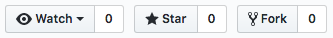

# Git Tutorial

This is tutorial is the bare minimum you need to get started using git.

## Task 1: Fork this repository to your github account

This copies this repository to your repository.

1. On GitHub, navigate to the [spara/git-tutorial](https://github.com/spara/git-tutorial)  repository.
2. Fork buttonIn the top-right corner of the page, click Fork.



## Task 2: Clone the repository

This copies the repository from Github to your computer.

```
git clone https://github.com/<your username>/git-tutorial.git
```

## Task 3: Make some changes to this document

Using your favorite editor, open README.md  add this line below `Task 4`:

```

```

## Task 4: Awwww!


## Task 5: Save

Save README.md

## Task 6: Add changes to the repo

This marks any files you have changed as staged or ready to be committed.

```
git add .
```

## Task 7: Commit the changes to the repo

This commits your staged changes to the local repository. The `-m` flag is to add a commit message to describe what has changed.

```
git commit -m "changed README.md'
```

## Task 8: Push to Github

This pushes changes from your local repo (master) to your remote repo (origin)) 

```
git push origin master
```

Check out you changes to README.md by browsing to your repository (refresh it if the page is already open).
